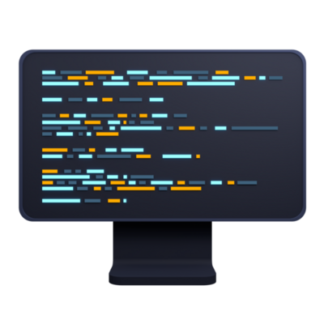

<!--suppress HtmlUnknownAnchorTarget, HtmlDeprecatedAttribute -->

  

<h1 align="center">
  REPOSITORY NAME
</h1>

   very short (1–2 lines) repository description

  📦 :octocat:

  

<!-- TABLE OF CONTENT -->

  
Table of Contents

  <ol>
    <li>
      <a href="#description">📃 Description</a>
      <ul>
        <li><a href="#built-with">🛠️ Built With</a></li>
      </ul>
    </li>
    <li>
      <a href="#getting-started">🪧 Getting Started</a>
      <ul>
        <li><a href="#prerequisites">Prerequisites</a></li>
        <li><a href="#installation">Installation</a></li>
      </ul>
    </li>
    <li>
      <a href="#how-to-use">⚠️ How to use</a>
      <ul>
        <li><a href="#possible-exceptions">Possible Exceptions</a></li>
      </ul>
    </li>
    <li><a href="#deployment">⬆️ Deployment</a></li>
    <li><a href="#reference">🔗 Reference</a></li>
  </ol>

 

## 📃 Description
General information about repo

(<a href="#top">back to top</a>)

### 🛠️ Built With
* [language + version](https://example.com)
* [framework name](https://example.com)

## 🪧 Getting Started
installation/build instructions\
including frameworks info it mainly uses

### Prerequisites
required tools/programs to be installed for using it

### Installation
installation steps/build setup information

(<a href="#top">back to top</a>)

## ⚠️ How to use
some usage examples

### Possible Exceptions
some errors, if any

(<a href="#top">back to top</a>)

## ⬆️ Deployment
how to deploy

(<a href="#top">back to top</a>)

## 🔗 Reference
some reference links to documentations

(<a href="#top">back to top</a>)
